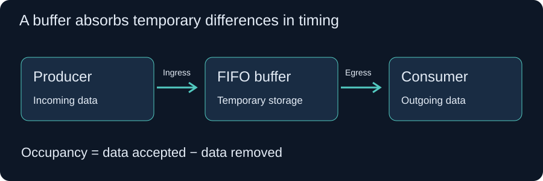
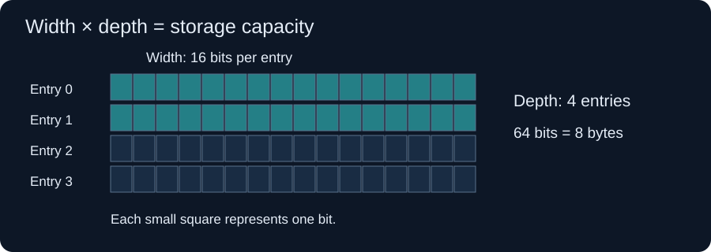
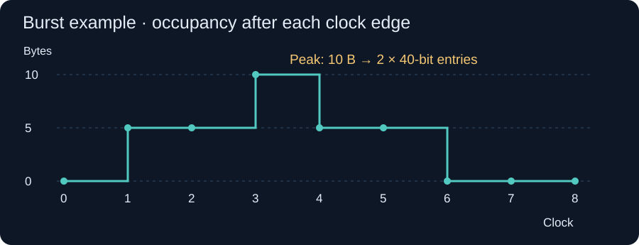

# Memory · Buffers, Width & Depth

How much storage is needed when incoming data and outgoing data do not move at the same pace?

## 1. Why a buffer exists

A **buffer** temporarily holds data waiting to be processed or transmitted. Think of a queue: arrivals may briefly be faster than departures, even when the receiver is fast enough on average.

- **Ingress:** data entering the system.
- **Egress:** data leaving the system.
- **Occupancy:** data currently waiting in the buffer.
- **FIFO (first in, first out):** a buffer that returns data in the order it arrived.

A buffer absorbs a temporary mismatch. It cannot solve an indefinitely sustained input rate greater than the available output rate.

## 2. Width, depth, and capacity

| Quantity | Meaning | Unit |
| :--- | :--- | :--- |
| Width, W | Bits stored in one entry (word) | bits/entry |
| Depth, D | Number of entries | entries |
| Capacity, C | Total data the buffer can hold | bits or bytes |

$$C_{bits}=W\times D$$

$$C_{bytes}=\frac{W\times D}{8}$$

**Example:** a 16-bit-wide buffer with depth 10 has 10 entries of 2 bytes each: 160 bits = 20 bytes.

**Units matter:** `b` means bit; `B` means byte; 1 B = 8 bits. Depth counts entries, not bytes, unless each entry happens to be one byte wide.

## 3. The occupancy equation

For interval n, let:

- q[n−1] = occupancy before the interval;
- a[n] = data actually accepted during it;
- d[n] = data actually removed during it.

$$q[n]=q[n-1]+a[n]-d[n]$$

All three data quantities must use the same unit. Departures are written as positive quantities in a table, then **subtracted** in the equation. Data itself is not negative.

The receiver's *ability* to read is not necessarily an actual departure: it may find the FIFO empty. For the clocked examples below, a read consumes previously stored data, and a write can happen at the same edge. There is no empty-FIFO bypass. For a byte-stream model with service allowance s[n]:

$$d[n]=\min(s[n],q[n-1])$$

This assumes the available data can be removed in the permitted transfer units. Fixed-word interfaces may require a complete word. A bypass design can instead serve newly arriving data immediately; that changes the model and sometimes the answer.

The required capacity is the **largest occupancy anywhere in the specified schedule**, including the initial state:

$$Q_{peak}=\max(q[0],q[1],\ldots,q[N])$$

If Q_peak is measured in bytes and entries are W bits wide:

$$D_{min}=\left\lceil\frac{8Q_{peak}}{W}\right\rceil$$

Round up: hardware cannot provide a fraction of an entry. This is the logical storage minimum under the stated timing model; physical FIFO choices and interface timing can impose additional constraints.

## 4. Example: 2,000 bits in, 1,000 bits out

If an initially empty buffer accepts 2,000 bits and actually sends 1,000 bits during an observation window:

$$q_{end}=2000-1000=1000\text{ bits}$$

That tells us the **final backlog**, not necessarily the maximum backlog.

| Timing information | Consequence |
| :--- | :--- |
| The peak backlog is known to be 1,000 bits | A 16-bit entry needs depth ceil(1000/16) = **63** |
| All 2,000 bits arrive before any leave | Peak backlog is 2,000 bits; depth is **125** |
| Only the totals are supplied | The exact minimum cannot be determined from those totals alone |

The 63-entry buffer stores 1,008 bits. Its extra 8 bits come from rounding to whole entries.

## 5. Example: 5 B in, 2 B out, 16-bit width, 100 ns

**Given:** ingress transfers 5 B per interval, egress actually removes 2 B per interval, and the observation time is 100 ns.

**Missing:** the interval duration or transfer frequency. The statement does not yet have a unique numerical answer.

Under an ideal model where each interval can deliver the stated 2 B departure, the net growth is:

$$\Delta q=5-2=3\text{ B/interval}$$

With N complete transfer intervals, an initially empty buffer has a peak of 3N B at the interval boundaries:

$$D_{min}=\left\lceil\frac{3N}{2}\right\rceil$$

For an **assumed** interval of 10 ns, there are 10 transfer intervals in 100 ns, so the result is 30 B / 2 B per entry = **15 entries**. This is an illustration, not a frequency provided by the original question. Count transfer events consistently at the window boundaries.

### Why the first read matters

For an initially empty synchronous FIFO with no bypass, the first scheduled 2 B read cannot happen at the first write edge. With ten writes and only nine successful reads:

$$Q_{peak}=10(5)-9(2)=32\text{ B}$$

That needs **16 entries** of 16 bits. Always establish when writes and reads happen, whether bypass exists, and whether the stated egress is a request or a successful transfer.

**Throughput check:** a single 16-bit write port accepts only 2 B per write. Receiving 5 B every clock requires packing/staging plus enough write bandwidth, a wider interface, multiple banks, or a faster write clock. Capacity arithmetic alone does not specify a working implementation.

## 6. Worked burst example

Use this explicit schedule:

- The buffer starts empty.
- The sender writes **5 B per clock for 3 clocks**, then is idle for **5 clocks**.
- The 8-clock pattern repeats.
- The receiver can read **5 B on clocks 2, 4, 6, and 8**.
- Reads take already stored data; simultaneous read and write are supported.

| Clock | Incoming (B) | Read allowance (B) | Actual outgoing (B) | Occupancy after edge (B) |
| ---: | ---: | ---: | ---: | ---: |
| 0 | — | — | — | 0 |
| 1 | 5 | 0 | 0 | 5 |
| 2 | 5 | 5 | 5 | 5 |
| 3 | 5 | 0 | 0 | **10** |
| 4 | 0 | 5 | 5 | 5 |
| 5 | 0 | 0 | 0 | 5 |
| 6 | 0 | 5 | 5 | 0 |
| 7 | 0 | 0 | 0 | 0 |
| 8 | 0 | 5 | **0** | 0 |

At clock 2: q = 5 + 5 − 5 = 5 B. At clock 3: q = 5 + 5 − 0 = 10 B. At clock 8 the receiver is eligible to read, but the buffer is empty, so no data departs.

### Required depth

Each natural transfer is 5 B = 40 bits. A **40-bit-wide FIFO with depth 2** stores the peak 10 B:

$$D_{min}=\left\lceil\frac{10\times8}{40}\right\rceil=2\text{ entries}$$

A 16-bit-wide storage array would need **5 entries** to hold the same 80 bits, but would need additional interface design to handle 40-bit transfers at the stated rate.

### Average rates and repetition

$$R_{in,avg}=\frac{3\times5}{8}=1.875\text{ B/clock}$$

$$R_{service,avg}=\frac{5}{2}=2.5\text{ B/clock}$$

The second number is available service capacity. The **actual** output over this period is 15/8 = 1.875 B/clock because unused read slots transmit nothing. The buffer empties before the next burst; the same schedule can repeat without accumulating backlog.

Average rates alone do not size the FIFO: the burst still requires 10 B even though average service capacity is higher than average input.

### If the read phase changes

If read opportunities are on clocks 1, 3, 5, and 7, with no empty bypass, the end-of-clock occupancies become **5, 10, 10, 10, 5, 5, 0, 0 B**. The peak is still 10 B, but clock 3 now needs a write while a read frees space from a full FIFO. Whether a particular FIFO accepts that operation depends on its interface rules. Recompute the schedule when the phase, latency, stalls, or initial occupancy changes.

## 7. From the calculation to hardware

**Overflow** means an incoming write cannot fit. Depending on the interface, the sender may be stalled through backpressure, the write may be rejected, or data may be lost. Do not assume overflow always has the same behavior.

**Underflow** is an attempted read when no valid data is available. Gate transfers with the FIFO's valid/ready or full/empty protocol.

Real FIFO IP can have delayed flags, specific full-state read/write restrictions, fixed supported depths, and different input/output widths. Intel's [FIFO signal documentation](https://www.intel.com/content/www/us/en/docs/programmable/813901/24-3/fifo-signals.html) describes write/read requests, full/empty flags, and protection behavior. AMD documents [FIFO width and depth](https://docs.amd.com/r/en-US/ug573-ultrascale-memory-resources/FIFO-Port-Width-and-Depth) and [flag timing](https://docs.amd.com/r/en-US/ug573-ultrascale-memory-resources/Flag-Assertion/Deassertion-and-Flag-Latencies). Check the selected device and IP configuration before implementing the mathematical minimum.

If backpressure takes L clocks to stop the sender, reserve space for the data that can still arrive during that delay. For a worst case of r B/clock and no draining during the delay, that headroom is rL B, plus any other in-flight data not already counted. Avoid counting the same traffic twice.

## 8. A repeatable sizing method

1. Write down units, entry width, initial occupancy, and the full traffic window.
2. Define transfer timing, burst pattern, read phase, and allowed stalls.
3. Separate scheduled read capacity from successful departures.
4. Build the occupancy table and find its maximum.
5. Convert peak bits or bytes into entries, rounding upward.
6. Check port bandwidth, flags, simultaneous operations, and backpressure latency.
7. For repeating traffic, check that occupancy does not grow from period to period.

## Quick revision

| Question | Answer |
| :--- | :--- |
| What is width? | Bits per entry |
| What is depth? | Number of entries |
| What is capacity? | Width × depth |
| What determines storage required? | Peak occupancy under the specified timing |
| Why subtract egress? | Departing data frees occupied storage |
| Is a faster average receiver enough to avoid a buffer? | No; bursts can still create a temporary queue |
| Does 100 ns determine the number of transfers? | Only when transfer timing is also known |
| Can storage capacity prove throughput? | No; port width and transfer rate must also be checked |

## Practice

1. What is the capacity of a 32-bit-wide, 16-entry FIFO?
2. A verified peak backlog is 19 B. How many 16-bit entries are needed?
3. A sender produces 4 B/clock while a receiver can sustain only 3 B/clock forever. Can a finite FIFO avoid eventual overflow without backpressure?

Check your answers

1. 32 × 16 = 512 bits = **64 B**.
2. ceil(19/2) = **10 entries**, providing 20 B.
3. **No.** Backlog grows by 1 B/clock once both rates are established. A finite buffer only postpones the problem.

---

[Back to Digital Electronics](../README.md) · Notes by **A2HIKA A**
